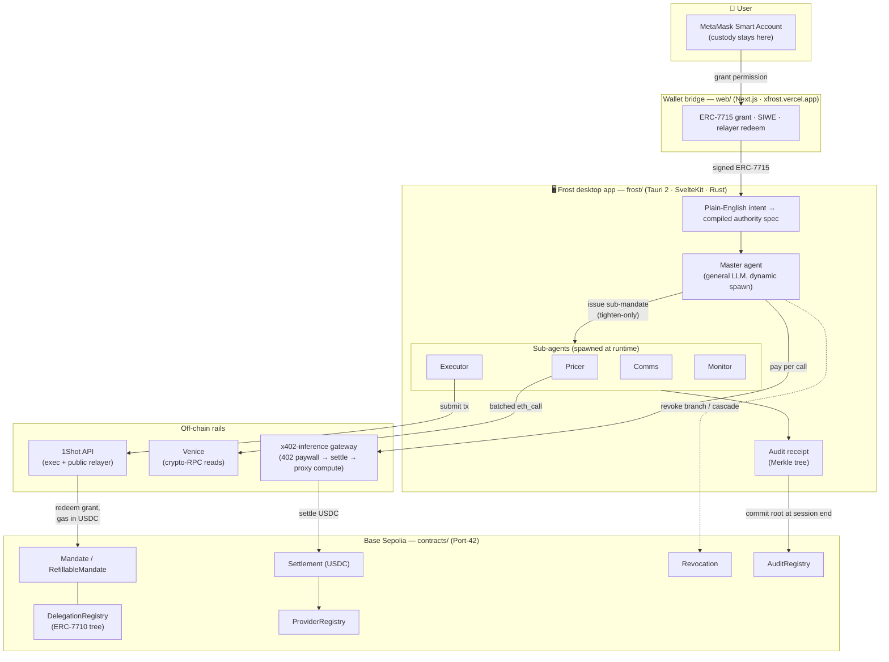
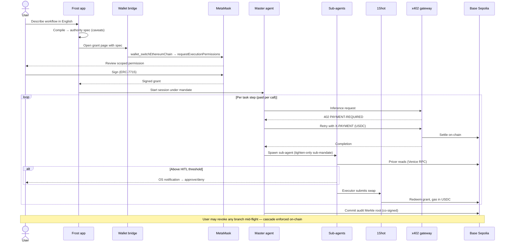

<div align="center">


# FROST

### **Web3-native agentic workflows through secure, contract-bounded agents**

<br>

[](./LICENSE)
[](https://sepolia.basescan.org/)
[](#sponsor-integration)
[](#sponsor-integration)
[](#sponsor-integration)
[](#sponsor-integration)
[](#repository-layout)

<br>

**[Background](#the-background)** · **[What it does](#what-it-does)** · **[Architecture](#architecture)** · **[User Flow](#user-flow)** · **[Contracts](#deployed-contracts-base-sepolia--chain-id-84532)** · **[Sponsors](#sponsor-integration)** · **[Develop](#continuing-development)** · **[License](#license)**

<br><br><br>
</div>

Frost is a desktop app where you describe an automated on-chain workflow in plain English and hand an AI agent **exactly the authority you choose** — scoped, signed, bounded, and revocable on-chain at any moment. The agent can never exceed what you granted, every sub-agent it spawns can only *narrow* that authority further, and **every decision it makes is written to a tamper-evident on-chain audit trail you can prove**.

Built for the **MetaMask Smart Accounts Kit × 1Shot API × Venice AI Dev Cook-Off** . Running live on **Base Sepolia**.

---

## The Background

Think about how an AI agent gets to *act* right now. You give it an API key, a hot-wallet private key, an admin token — and that credential is **unbounded, non-expiring, irrevocable, and unaccountable**. There is no ceiling on what it can spend. There is no expiry. There is no "only these actions." If the agent is buggy, jailbroken, or simply confident and wrong, it can drain the wallet, hit any endpoint, spin up copies of itself, and call privileged functions — and you find out *afterward*, if at all. The entire safety model is **"trust the agent."** That's the status quo, and it's why nobody sane lets an autonomous agent touch real money unattended.

**Frost inverts the default.** Instead of handing the agent a master key and hoping, you hand it a **mandate**: a signed, scoped, on-chain permission that says *precisely* what it may do and nothing more.

1. **Bounded, delegated authority — the foundation.** You grant the agent a precise permission straight from your own MetaMask: a spend cap, a slippage tolerance, a human-approval threshold, an expiry, and a hard limit on how many sub-agents it may spawn and for how much. The master agent redelegates to specialist sub-agents under **ERC-7710**, and the contract enforces that a child can only *tighten* the rules — never loosen them. Every transaction executes through **1Shot** inside those bounds. You can revoke any branch — or the master's entire spawning authority — mid-flight, enforced on-chain. *This is what makes an autonomous agent safe to walk away from.*

2. **Paid per call, from the same budget — the rail.** The agent's inference and reads settle **per call in USDC** over **x402**, funded by your own Smart Account. There's no standing credential sitting around to be stolen, because the budget and the credential are the same revocable object. Spend the cap and it stops. Revoke the mandate and it stops.

3. **An on-chain audit trail — the receipt no other agent gives you.** Every decision — each sub-mandate, settlement, route choice, approval, and planning step — is hashed into a Merkle tree and **committed on-chain at session end, co-signed by you**. Anyone can later prove that any single decision was in the record and that the record wasn't altered. You don't have to trust the agent's account of what it did and you can verify it.

The thing a normal API key can never be — *scoped, expiring, revocable, and accountable* — is exactly what Frost makes the agent's authority.

---

## What it does

You type something like:

> *"If ETH dips, swap part of my position to USDC on whichever Base DEX is cheapest, then post an update to my Discord."*

Frost compiles that into a **structured authority spec** with explicit caveats (spend cap, slippage tolerance, HITL threshold, redelegation bounds, comms template). You review the *compiled* spec — the thing the contract enforces byte-for-byte — and grant it from your own MetaMask via **ERC-7715 Advanced Permissions**. Then:

- A **master agent** plans the task with a general LLM and **dynamically spawns** specialist sub-agents — it is not a fixed monitor/executor/comms template.
- **Pricer** sub-agents compare DEX routes in parallel (on-chain Uniswap v3 reads via Venice + the Paraswap aggregator) and pick the best.
- An **executor** sub-agent runs a pre-submission caveat check, pulls a live slippage floor, and submits the swap through **1Shot**.
- A **comms** sub-agent posts the result to Discord under a signed template.
- Anything above your **HITL threshold** pauses for an OS-notification approval.
- You can **revoke** the master's spawning authority mid-flight as the cascade is enforced on-chain.
- At session end, the audit trail's **Merkle root is committed on-chain** (co-signed by you).

Underneath is **Port-42** — an internal-codename rail combining MetaMask Smart Accounts, ERC-7710 redelegation, x402 stablecoin settlement, Venice AI (crypto-RPC reads + x402 inference), and 1Shot (execution + relayer). Port-42 is entirely internal, actual the product is **Frost**.

---

## Architecture



## User Flow



---

## Deployed contracts (Base Sepolia · chain id `84532`)

Six Port-42 contracts + an audit anchor are deployed and wired, all one-time admin setters (`setMandateContract`, `setMandate`, `setSettlement`) have been called and are **permanently locked** (they revert on a second call). Deployer/admin: `0xce4389ACb79463062c362fACB8CB04513fA3D8D8`. USDC (immutable in `Settlement`): [`0x036CbD53842c5426634e7929541eC2318f3dCF7e`](https://sepolia.basescan.org/address/0x036CbD53842c5426634e7929541eC2318f3dCF7e). Solc `0.8.26`, EVM `cancun`. Full ABIs live in `contracts/abi/*.json`.

| Contract | Address (→ Basescan) | What it does |
|---|---|---|
| `Mandate` | [`0x4F03b0df…57FE`](https://sepolia.basescan.org/address/0x4F03b0df6cBB79be9E19872EF7B6809e36fA57FE) | Issues mandates/sub-mandates, validates each operation against caveats |
| `RefillableMandate` | [`0x4DeC8703…b76E`](https://sepolia.basescan.org/address/0x4DeC870341cfcbc208b5A7c985946e49Eb70b76E) | Refill policy, mints a fresh `mandateId` per cycle |
| `DelegationRegistry` | [`0x4981C4Ad…1D6C`](https://sepolia.basescan.org/address/0x4981C4Ad54D1ceF31Ef9F8Dc4627CdeEEc841D6C) | The ERC-7710 mandate tree: parent/child, depth, aggregate budget |
| `Settlement` | [`0xFBCd30DF…A860`](https://sepolia.basescan.org/address/0xFBCd30DF3633b92bc79dAC6E94b7461E568CA860) | EIP-712 USDC settlement per call, with revocation grace check |
| `ProviderRegistry` | [`0x6E33f6ec…5cBd`](https://sepolia.basescan.org/address/0x6E33f6ec96Be0660E4E5573338113214538D5cBd) | Approved x402 providers + manifest hashes |
| `Revocation` | [`0xadc993c5…9FE9`](https://sepolia.basescan.org/address/0xadc993c5dC34d1017dCAD10651Aff89233b39FE9) | Revoke a mandate, ancestor-revoked cascades on-chain |
| `AuditRegistry` | [`0xeA157DE7…319B`](https://sepolia.basescan.org/address/0xeA157DE7D1ec58a0610D82171bbb4873bc19319B) | One Merkle root per session — the tamper-evident commitment |

Key constants: `Settlement.REVOCATION_LATENCY_BLOCKS = 30` (≈1 min) · `Caveats.MAX_DELEGATION_DEPTH = 5` · `MAX_FAN_OUT_PER_NODE = 10` · `MAX_CAVEATS_PER_MANDATE = 24`. Settlement EIP-712 domain: `name="Frost Settlement"`, `version="1"`, `chainId=84532`.

```bash
# Live domain separator
cast call 0xFBCd30DF3633b92bc79dAC6E94b7461E568CA860 'domainSeparator()(bytes32)' --rpc-url https://sepolia.base.org
```

**Proven live on testnet:** root + sub-mandate issuance · a real WETH→USDC swap via 1Shot · an `AuditRegistry` commit · a `Revocation.revoke` cascade · an **x402 pay-per-inference** loop with on-chain settlement (payer USDC `154.999 → 154.998` for one call) · **x402 paid via an ERC-7710 delegation** · an ERC-7715 `erc20-token-periodic` grant from the user's MetaMask.

---

## Sponsor Integration

Every link below points at the exact source line that exercises the sponsor's primitive.

### MetaMask Smart Accounts Kit — bounded, delegated authority

| Primitive | Code |
|---|---|
| **ERC-7715 Advanced Permissions** — the user grants a scoped, signed `erc20-token-periodic` permission from their own MetaMask | [`web/app/connect/grant-permissions/page.tsx#L407`](https://github.com/charlesms1246/Frost/blob/main/web/app/connect/grant-permissions/page.tsx#L407) |
| **Chain-switch preflight** (`wallet_switchEthereumChain` + `wallet_addEthereumChain` fallback) so Flask's permission preview can read token balances | [`web/app/connect/grant-permissions/page.tsx#L314`](https://github.com/charlesms1246/Frost/blob/main/web/app/connect/grant-permissions/page.tsx#L314) |
| **EIP-7702 session delegation** — the agent's session key is delegated to the MetaMask gator so it can act under the grant | [`frost/src/lib/agent/session-7702.ts`](https://github.com/charlesms1246/Frost/blob/main/frost/src/lib/agent/session-7702.ts) |
| **ERC-7710 redelegation, tighten-only** — caveat intersection (`HITL_THRESHOLD` uses `max(parent, sub)`) | [`contracts/src/Caveats.sol#L275`](https://github.com/charlesms1246/Frost/blob/main/contracts/src/Caveats.sol#L275) |
| **Mandate-tree registration** (depth, fan-out, aggregate budget) | [`contracts/src/DelegationRegistry.sol#L96`](https://github.com/charlesms1246/Frost/blob/main/contracts/src/DelegationRegistry.sol#L96) |

### 1Shot API — execution & gas abstraction

| Primitive | Code |
|---|---|
| **Transaction submission** through 1Shot's contract-methods API | [`agent/src/executor/oneshot-submitter.ts#L43`](https://github.com/charlesms1246/Frost/blob/main/agent/src/executor/oneshot-submitter.ts#L43) |
| **Public relayer** — `relayer_send7710Transaction` redeems the grant, gas paid in USDC | [`agent/src/executor/relayer.ts#L170`](https://github.com/charlesms1246/Frost/blob/main/agent/src/executor/relayer.ts#L170) |
| **1Shot x402 facilitator** verifies + settles the inference payment | [`x402-inference/src/server.ts#L28`](https://github.com/charlesms1246/Frost/blob/main/x402-inference/src/server.ts#L28) |

### Venice AI — read-side inference & RPC

| Primitive | Code |
|---|---|
| **Crypto-RPC, batched** — one network round-trip per pricer/monitor batch (100 req/min cap, a JSON-RPC batch counts as 1) | [`agent/src/pricer/venice-rpc.ts#L70`](https://github.com/charlesms1246/Frost/blob/main/agent/src/pricer/venice-rpc.ts#L70) |
| **x402 inference interface** (reference target the gateway emulates) | [`agent/src/inference/venice-inference.ts`](https://github.com/charlesms1246/Frost/blob/main/agent/src/inference/venice-inference.ts) |

### x402 — pay-per-call USDC settlement

| Primitive | Code |
|---|---|
| **Gateway**: `402 PAYMENT-REQUIRED` → verify `X-PAYMENT` → settle USDC → proxy compute | [`x402-inference/src/server.ts#L28`](https://github.com/charlesms1246/Frost/blob/main/x402-inference/src/server.ts#L28) |
| **Client**: acquires the `X-PAYMENT` header (EIP-3009 `transferWithAuthorization`) on the 402 | [`agent/src/inference/x402-inference.ts`](https://github.com/charlesms1246/Frost/blob/main/agent/src/inference/x402-inference.ts) |
| **On-chain settlement** (EIP-712 `PaymentAuthorization` → USDC `transferFrom`) | [`contracts/src/Settlement.sol#L128`](https://github.com/charlesms1246/Frost/blob/main/contracts/src/Settlement.sol#L128) |

---

## Repository layout

The monorepo is intentionally flat, each subproject is self-contained.

```
frost/            Tauri v2 + SvelteKit + Rust desktop app (the product)
web/              Next.js wallet bridge — xfrost.vercel.app/connect/ (ERC-7715 grant, SIWE, relayer redeem)
agent/            @frost/agent runtime — compiler, planner, sub-agents, x402 clients, 1Shot relayer
sdk/              @frost/sdk — caveat builders, mandate ops, contract bindings
contracts/        Foundry — the six Port-42 contracts + AuditRegistry (deployed)
x402-inference/   Self-deployed x402 inference gateway (settles USDC per call, proxies compute)
spikes/           Verification spikes (mempool, rate limits, 7715, 7710 delegatio, etc..)
```

---

## Continuing development

> **Before you clone:** a full install is **~11.1 GB**. `node_modules`, `dist`, and `.env` are gitignored in every subproject. Do **not** run a single recursive `npm install` across the repo — install per-subproject, only the ones you're touching. The heaviest costs are `frost/` (Tauri + Rust target/) and `contracts/` (Foundry `out/` + `cache/`). On a clean machine, expect the first `frost` build to be slow.

**Prerequisites:** Node 20+, Rust toolchain (for Tauri), and Foundry (`forge`, `cast`) for the contracts. Live runs read credentials from `D:\Frost\.env` never commit it, never put `MONGODB_URI`/`JWT_SECRET` there as that file ships with the desktop app.

```bash
# 1. Desktop app (primary dev loop) — Vite on :1420, then the Tauri shell
cd frost && npm install && npm run tauri dev

# 2. Wallet bridge — Next.js on :3000
cd web && npm install && npm run dev

# 3. Agent runtime — rebuild after editing agent/src so the webview picks up dist/
cd agent && npm install && npm run build && npm test

# 4. Contracts
cd contracts && forge test
```

**Adding a Tauri IPC command** requires three edits or the call is rejected at runtime: a `#[tauri::command]` in `frost/src-tauri/src/lib.rs`, registration in `generate_handler!`, and a capability grant in `frost/src-tauri/capabilities/default.json`. The Rust crate is intentionally named `frost_lib` (Windows bin/lib collision workaround).

**Working in `web/`:** it's Next.js 16 / React 19, which has breaking changes vs. older versions. If `npm install` leaves a partial `viem` (Turbopack errors like `Unknown module type` on raw TS), nuke and reinstall: `Remove-Item -Recurse -Force web/node_modules/viem; npm install viem`. Use `next build` (not `tsc --noEmit`) for type-checking.

**Redeploying contracts** (after a change), from `contracts/`:

```bash
forge script script/Deploy.s.sol:Deploy --rpc-url "$RPC" --private-key "$PK" --broadcast --slow
# then re-extract ABIs into contracts/abi/ and update the addresses in the table above
```

**Verifying on Basescan:**

```bash
forge verify-contract <ADDRESS> src/<Contract>.sol:<Contract> \
  --chain-id 84532 \
  --constructor-args $(cast abi-encode '<signature>' <args...>) \
  --compiler-version v0.8.26+commit.8a97fa7a \
  --etherscan-api-key $BASESCAN_API_KEY
```

**Deploying the bridge:** `web/` deploys to Vercel with **Root Directory `web`** (the repo root has no `package.json`). Required env vars: `MONGODB_URI`, `MONGODB_DB`, `JWT_SECRET`, `SIWE_DOMAIN`, `SIWE_URI`, `SIWE_CHAIN_ID=84532`, `SIWE_RPC_URL`. MongoDB Atlas must allow Vercel's dynamic IPs (Network Access → `0.0.0.0/0`).

---

## License

Licensed under the **GNU General Public License v3.0** (GPL-3.0). See [`LICENSE`](./LICENSE) for the full text.

---

<br><br><br>

<div align="center">

<h3>Built By

[Charles](https://github.com/charlesms1246) x [Immanuel](https://github.com/xavio2495)

</h3>
</div>
